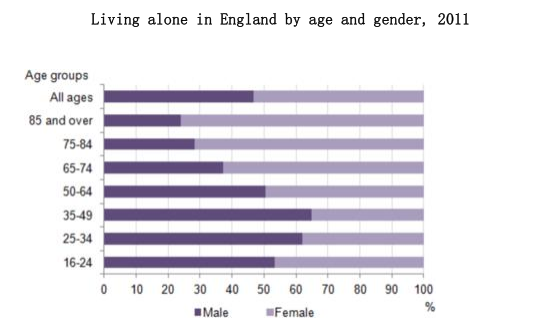
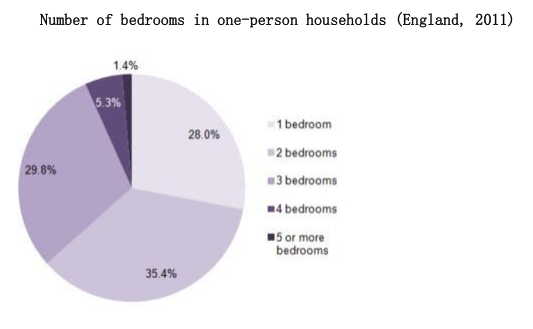

# Day3: 2024.12.18 & 2024.12.19

## Recite: Jogging

Every day, in all kinds of weather, thousands of men and women go 
jogging. Why has jogging—running slowly for long distances—become 
so popular? Most joggers like it because they have heard it is a very 
good exercise. Jogging makes the heart stronger and helps people lose 
weight. It can also help them feel better about themselves.  

How fast should you go? Jog with a friend and talk to each other as you 
run. If you have difficulty talking, you are going too fast. How far should 
you jog? Remember not to go too far too soon. In fact you should walk, 
not run, the first few times. Then do some short jogs, but no more than 
what you can do comfortably.  

After that, increase your distance a quarter or half of a mile every two 
weeks or so. Maybe in a few years, you, too, can run in a marathon like 
thousands of other people do. 

## Recite: 杨帅 谈论一个还未实现的理想

An ambition I have is writing and publishing my own book.

I've always loved reading, and writing a book has been a dream of mine since childhood.

I've written some short stories and brainstormed ideas for my novel, but I haven't started working on the actual book.

## Recite: 杨帅 谈论一步电影

Recently, I watched the movie The Pursuit of Happiness, which I really enjoyed.

It stars Will Smith, who plays Chris Gardner, a man struggling to make ends meet while caring for his young son.

- Star 这里表示由 sb 主演
- Make ends meet 维持生计，end 表示末端，理解为让两端相接

It's a motivational film that reminds me to appreciate the little things in life and stay positive in the face of challenges.

## Recite: 杨帅 Part2 A beautiful city

Question: Describe a beautiful city.
You should say: Where it is. How you know it. What it is famous for. 
And explain why you think it is a beautiful city.

I'm going to talk about Shanghai, which is a cosmopolitan city. 
I think it's one of the biggest metropolis cities in the world. 
It's situated in the south of China in the Yangtze River Delta. 
I know the city because, well, everybody knows it, not only in China, 
but all over the world. 
I don't remember when I first heard about this city. 
I think I was in primary school, and I learned about it in a textbook. 
I'm sorry, it's been a long time, so my memory is a little vague. 

- Cosmopolitan 世界性的
- Metropolis 大都市，一个国家的主要城市
- Yangtze River Delta 长江三角洲

Shanghai is famous for tons of things, including its strong economy, 
its skyscrapers, and also the bund. 
You know, the bund is a very well-known tourist attraction in Shanghai. 
It is also a business center because, 
right next to the bund is the Huangpu River,
and then further that way are a lot of modern high-rises 
where many international companies headquarters are located. 
And then on the other side of the bund are many historical buildings 
which date back to 100 years ago.

- Skyscraper 摩天大楼
- Bund 外滩
- High-rise 高层建筑、高楼
- Headquarters 总部
- Date back to 追溯到

So when you are walking on the bund 
and it really gives you a glimpse of the past, 
I think Shanghai is a really beautiful city, 
mainly because of the Bund.
It's a very spectacular place. 
When you are there, 
you just can't help but admire the beautiful scenery.
Plus it's a combination of the past and today. 
So, yeah, it's just, you know, you get the best of both worlds. 
It's really awesome. 

- Spectacular 壮观的（Very impressive）
- Get the best of 表示享受到好处

## Recite: SIMON Part1-6

The bar chart below shows the proportions of English 
men and women of different ages who were living alone in 2011. 
The pie chart compares the
numbers of bedrooms in these one-person households.

The two charts give information about single-occupant households in
England in the year 2011. The bar chart compares figures for occupants'
age and gender, and the pie chart shows data about the number of bedrooms
in these homes.

Overall, females made up a higher proportion of people living alone than
males, and this difference is particularly noticeable in the older age
categories. We can also see that the most common number of bedrooms in
a single-occupant home was two.

- Age category 年龄段

A significant majority of the people aged 65 or over who were living alone
in England in 2011 were female. Women made up around 72% of single
occupants aged 75 to 84, and 76% of those aged 85 or over. By contrast,
among younger adults the figures for males were higher. For example, in
the 35-49 age category, men accounted for nearly 65% of people living
alone.

- Significant majority of 绝大多数
- Account for 占比

In the same year, 35.4% of one-person households in England had two
bedrooms, while one-bedroom and three-bedroom homes accounted for 28% and
29.8% of the total. Under 7% of single-occupant homes had four or more
bedrooms.

## Recite: SIMON Part2-3

Question: Some people believe that studying at university or college 
is the best route to a successful career, 
while others believe that it is better to 
get a job straight after school.
Discuss both views and give your opinion.

When they finish school, 
teenagers face the dilemma of whether to 
get a job or continue their education. 
While there are some benefits to 
getting a job straight after school, 
I would argue that it is better to 
go to college or university.

The option to start work straight after
school is attractive for several reasons. 
Many young people want to start earning money as soon as possible. 
In this way, they can become independent, 
and they will be able to afford their own house or start a family. 
In terms of their career, 
young people who decide to find work, 
rather than continue their studies, 
may progress more quickly. 
They will have the chance to gain real experience 
and learn practical skills related to their chosen profession.
This may lead to promotions and a successful career.

On the other hand, 
I believe that it is more beneficial for students 
to continue their studies. 
Firstly, academic qualifications are required in many professions. 
For example, it is impossible to become a doctor, 
teacher or lawyer without having the relevant degree. 
As a result, 
university graduates have access to more and better job opportunities,
and they tend to earn higher salaries than those with fewer qualifications.
Secondly, the job market is becoming increasingly competitive, 
and sometimes there are hundreds of applicants for one position in a company. 
Young people who do not have qualifications 
from a university or college will not be able to compete.

For the reasons mentioned above, 
it seems to me that students are more likely to 
be successful in their careers 
if they continue their studies beyond school level.

